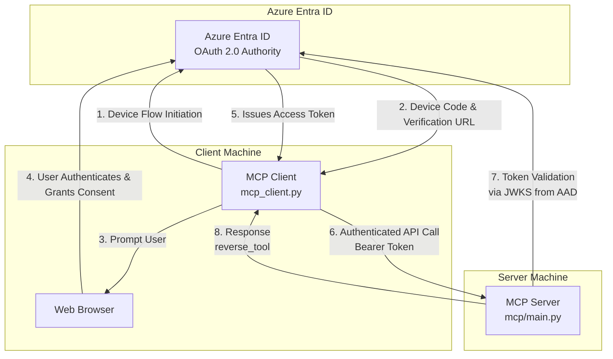

# Authenticated FastMCP Server and Client

This project demonstrates a secure client-server setup using the FastMCP framework, with authentication handled by Microsoft Azure Entra ID. It includes:

1.  **An MCP Server**: A `FastMCP` server that exposes a simple `reverse_tool`. It's protected by Azure Entra ID, requiring a valid JWT Bearer token for access.
2.  **An MCP Client**: A command-line client that authenticates against Azure Entra ID using a device flow, obtains a JWT token, and uses it to communicate with the secure MCP server.

⚠️ **Important:** this does not follow the MCP authorization specification (e.g., with dynamic client registration etc...); this simply implements bearer auth as discussed here: https://gofastmcp.com/servers/auth/bearer; both the FastMCP server and client support this; this works with any auth service; this post uses Entra ID as an example

## Diagram

```

## Features

-   **Secure MCP Server**: Authentication middleware using `BearerAuthProvider` to validate Azure Entra ID tokens.
-   **Device Flow Authentication**: User-friendly, browser-based authentication for the command-line client.
-   **Token Caching**: The client caches the authentication token to avoid repeated logins.
-   **Asynchronous Communication**: Built on `asyncio` for efficient, non-blocking operations.
-   **Progress Reporting**: The server's tool reports progress back to the client during execution.
-   **Optional Authentication**: The client can bypass authentication for testing against an unsecured server.

---

## Project Structure

```
.
├── api/                  # Alternative FastAPI implementation
├── mcp/
│   └── main.py           # The FastMCP server application
├── web/                  # React-based web client
├── mcp_client.py         # The Python-based MCP client
├── pyproject.toml        # Project dependencies
└── README.md             # This file
```

---

## Setup and Configuration

### Prerequisites

-   Python 3.8+
-   `uv` package manager (or `pip`)
-   An Azure account with permissions to create and manage App Registrations.

### 1. Clone the Repository

```bash
git clone <repository-url>
cd fastmcp-auth
```

### 2. Set up Azure Entra ID

You need to create two **App Registrations** in your Azure portal:

1.  **Server App Registration (API)**:
    -   Create a new App Registration for the MCP server.
    -   Go to **Expose an API** and set an **Application ID URI**. It will look like `api://<server-client-id>`.
    -   Add a scope named `execute` and grant admin consent.
    -   Note the **Application (client) ID** and the **Directory (tenant) ID**.

2.  **Client App Registration (Client)**:
    -   Create another App Registration for the client.
    -   Go to **Authentication** and enable "Allow public client flows".
    -   Go to **API permissions**, click **Add a permission**, select **My APIs**, and choose your server app.
    -   Select the `execute` permission you created and grant admin consent.
    -   Note the **Application (client) ID**.

### 3. Environment Configuration

The applications are configured using constants in the source code. For a production setup, it's recommended to use environment variables.

**Server (`mcp/main.py`)**:
Update these values with your Azure App Registration details:
-   `TENANT_ID`: Your Azure Directory (tenant) ID.
-   `CLIENT_ID`: The Application (client) ID of the **server** app registration.

**Client (`mcp_client.py`)**:
Update these values with your Azure App Registration details:
-   `TENANT_ID`: Your Azure Directory (tenant) ID.
-   `CLIENT_ID`: The Application (client) ID of the **client** app registration.
-   `API_SCOPE`: The Application ID URI of the **server** app, appended with `/.default` or the specific scope name (e.g., `api://<server-client-id>/execute`).

### 4. Install Dependencies

Use `uv` (or `pip`) and the `pyproject.toml` file to install the required Python packages.

```bash
uv pip install -r requirements.txt
```
*(Note: If a `requirements.txt` does not exist, you may need to create one from `pyproject.toml` or install packages like `fastmcp`, `msal`, `python-dotenv`, `click` manually.)*

---

## Running the Applications

### 1. Start the MCP Server

Open a terminal and run the server:

```bash
python mcp/main.py
```

The server will start on `http://0.0.0.0:8000`. You will see log messages indicating that the authenticated server is running.

### 2. Run the MCP Client

Open a second terminal to run the client.

#### With Authentication (Default)

```bash
python mcp_client.py
```

**Authentication Flow**:
1.  The first time you run it, the client will initiate a device flow.
2.  You will be prompted to open a URL in your browser (e.g., `https://microsoft.com/devicelogin`) and enter a code.
3.  After you authenticate and grant consent, the client will receive a JWT token.
4.  This token is cached in a file named `.token_cache.json` in the project root.
5.  The client then connects to the server, lists the available tools, and calls the `reverse_tool`.

On subsequent runs, the client will silently use the cached token, and you won't need to log in again until it expires.

#### Without Authentication

If you want to test the client against a server that does *not* have authentication enabled, use the `--no-auth` flag:

```bash
python mcp_client.py --no-auth
```

This will skip the token acquisition process and send requests without an `Authorization` header.

---

## How It Works

### Server (`mcp/main.py`)

-   **Authentication Provider**: It uses `fastmcp.server.auth.BearerAuthProvider` to protect its endpoints.
-   **Configuration**: The provider is configured with the `jwks_uri`, `issuer`, `audience`, and required `scopes` for your Azure Entra ID tenant. The JWKS (JSON Web Key Set) URI is a standard endpoint where Azure publishes the public keys needed to verify its JWT signatures.
-   **Token Validation**: When the client sends a request with a `Bearer` token, the `BearerAuthProvider` automatically:
    1.  Fetches the public key from the JWKS endpoint.
    2.  Verifies the token's signature, issuer, and audience.
    3.  Checks if the token has not expired.
    4.  Ensures the token contains the required scopes (e.g., "execute").
    5.  If any check fails, it returns a `401 Unauthorized` or `403 Forbidden` error.
-   **Tool**: It defines a simple `reverse_tool` that reverses a string and reports its progress over 5 seconds.

### Client (`mcp_client.py`)

-   **MSAL Library**: It uses the `msal` (Microsoft Authentication Library for Python) to handle the complexities of OAuth 2.0.
-   **Public Client**: It's configured as a `PublicClientApplication`, which is suitable for desktop and mobile apps where the client secret cannot be securely stored.
-   **Device Flow**: For a command-line application, the device flow provides a secure way for users to sign in through their browser without the application having to handle credentials directly.
-   **Token Cache**: `msal` provides a serializable token cache. The client script saves the cache to a local file (`.token_cache.json`) and loads it on startup. This provides a seamless single sign-on (SSO) experience after the first login.
-   **API Calls**: Once the `access_token` is obtained, it's included in the `Authorization` header of the HTTP requests sent to the MCP server by the `StreamableHttpTransport`.
